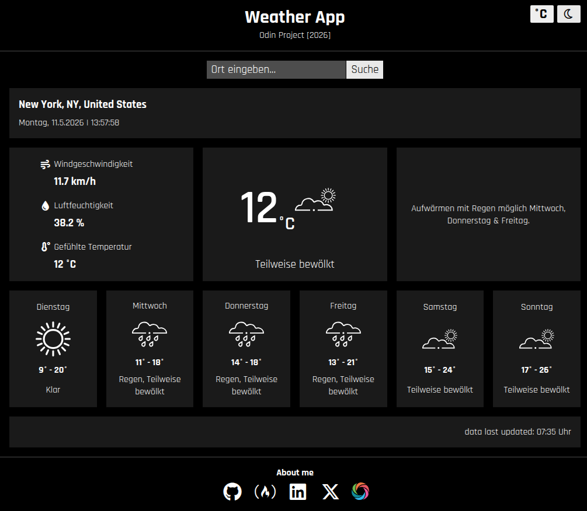
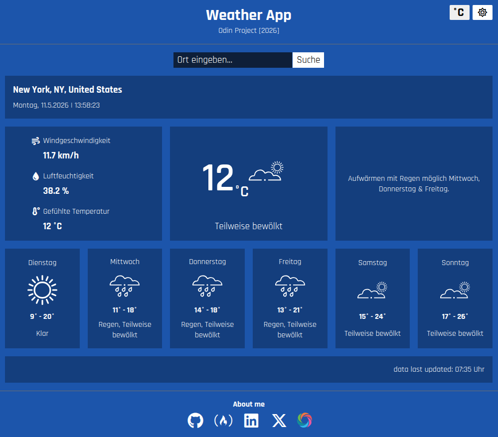
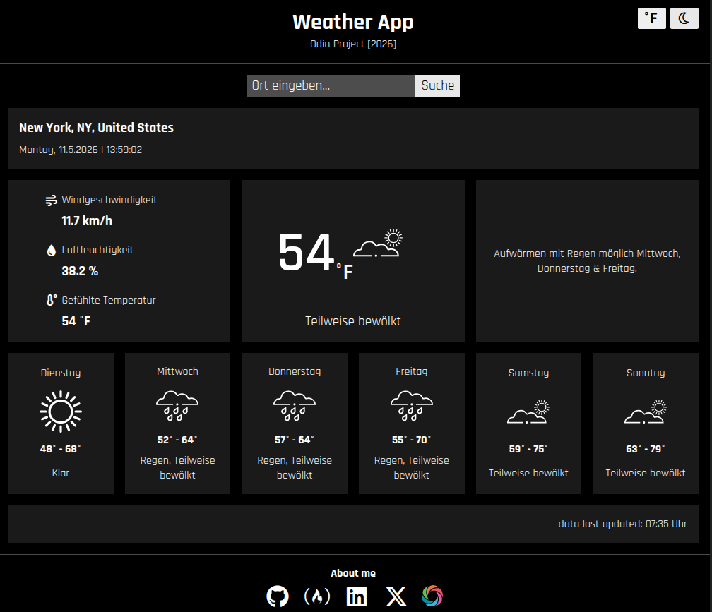
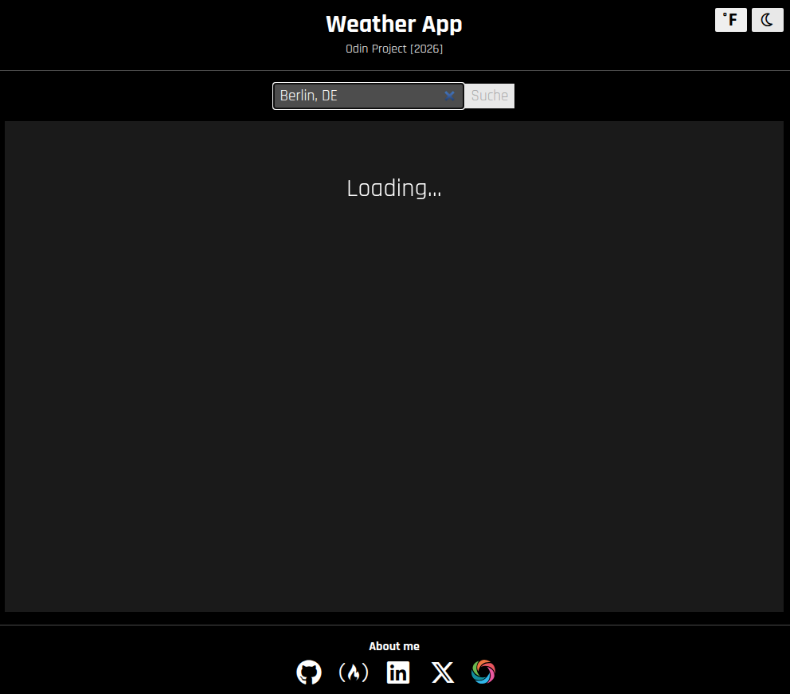

# weather-app

Project: Weather App (The Odin Project: JavaScript Course)

## ℹ️ Description

This program fetches data from visual crossing and displays current time, date and weather.
It also displays a 6 day forecast.

## ✅ Features

- takes a location as user input
- displays current weather and 6-day weather forecast
- displays current time
- switch between light & dark theme, if nothing was selected browser theme is applied
- switch between Celsius & Fahrenheit
- saves user selection for temperature and theme
- on user search a loading screen is shown
- responsive layout for different screen sizes

## ⚙️ Tech Stack

  
  
  
  
  

## 🖥️ Live Demo

https://mightycharm.github.io/weather-app/

## 📸 Screenshots

<figure>
  
  <figcaption>Dark Theme</figcaption>
</figure>
<figure>
  
  <figcaption>Light Theme</figcaption>
</figure>
<figure>
  
  <figcaption>Temperature in Fahrenheit</figcaption>
</figure>
<figure>
  
  <figcaption>Loading Screen</figcaption>
</figure>

## 🔧 Setup

1. Run `npm run dev`
2. Open `http://localhost:8080`

## 🚀 Deploy

- `git checkout gh-pages && git merge main --no-edit`
- `npm run build`
- `git add dist -f && git commit -m "Deployment commit"`
- `npm run deploy`
- `git checkout main`
